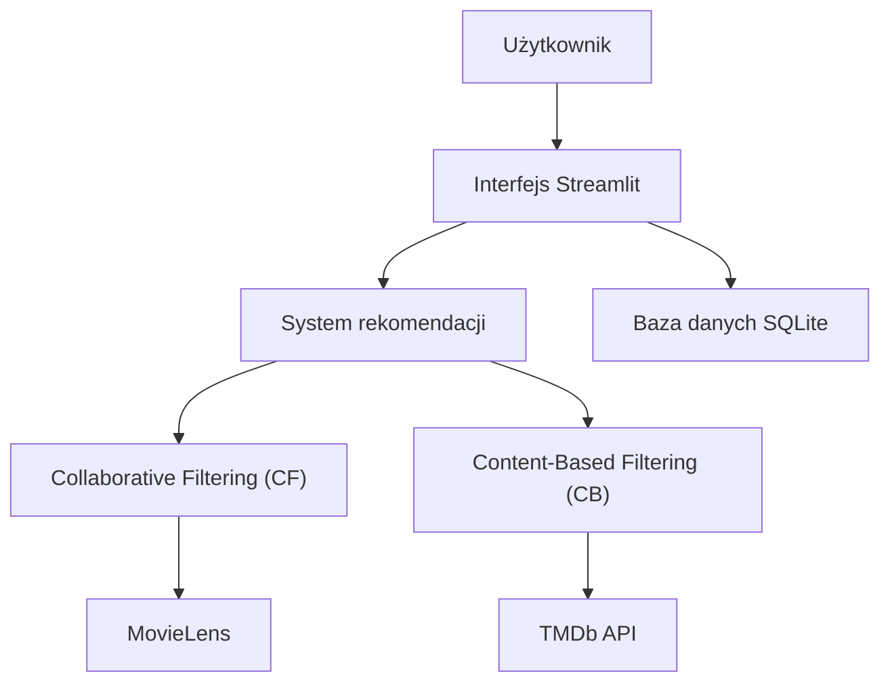

# Film Recommendation System 🎬
## Spis treści
1. [Opis projektu](#opis-projektu)
2. [Funkcje](#funkcje)
3. [Technologie](#technologie)
4. [Architektura](#architektura)
5. [Harmonogram](#harmonogram)
6. [Uruchamianie](#uruchamianie)
7. [Kontakt](#kontakt)
8. [Autorzy](#autorzy)
    
## Opis projektu
Inteligentny system rekomendacji filmów, który przewiduje preferencje użytkowników na podstawie ich ocen oraz porównania filmów względem treści. System ma charakter hybrydowy, łącząc dwie techniki rekomendacyjne:

### Collaborative Filtering (CF)
Model uczy się na podstawie ocen użytkowników z zestawu MovieLens. Przewiduje, jak bardzo dany użytkownik polubi film, którego jeszcze nie oglądał.

### Content-Based Filtering (CB)
Analiza treści filmu — gatunków, opisu, obsady — pobranych z TMDb API. Metoda umożliwia rekomendowanie również najnowszych filmów, których brakuje w MovieLens.

## Funkcje
- **Trafne rekomendacje oparte na CF** – przewidywanie preferencji użytkownika na podstawie podobieństwa do innych użytkowników.
- **Rekomendacje najnowszych filmów dzięki CB** – analiza treści filmów (gatunki, opis, obsada) pozwala sugerować także produkcje spoza MovieLens.
- **Personalizacja wyników** – generowanie rekomendacji dopasowanych do indywidualnych preferencji użytkownika.
- **Wizualna prezentacja filmów** – atrakcyjne wyświetlanie sugerowanych tytułów.
- **Aplikacja webowa w Streamlit** – jednolity system pełniący rolę interfejsu użytkownika oraz logiki aplikacji.

## Technologie
- **Język programowania:** Python  
- **Interfejs użytkownika:** Streamlit  
- **Baza danych:** SQLite  
- **Źródło danych do modelu rekomendacji:** MovieLens  
- **Źródło danych o filmach:** TMDb API  
- **System kontroli wersji:** GitHub  
- **Konteneryzacja aplikacji (opcjonalnie):** Docker
## Architektura

## Harmonogram 
| Data zakończenia | Etap | Zakres zadań |
|-----------------|------|---------------|
| 16.11.2025 | Określenie tematyki projektu | Przygotowanie wstępnego opisu, ustalenie celów projektu, wybór kierunku rozwiązań oraz opracowanie wstępnych założeń funkcjonalnych i spodziewanych rezultatów. |
| 30.11.2025 | Utworzenie repozytorium i architektury | Utworzenie repozytorium projektu, przygotowanie wstępnej architektury systemu (warstwa danych, rekomendacji, interfejs użytkownika), organizacja struktury projektu i konfiguracja środowiska pracy. |
| 16.12.2025 | Przygotowanie danych wejściowych | Analiza i wstępne przetworzenie danych o ocenach filmów, utworzenie bazy danych projektu, import danych o filmach i użytkownikach oraz powiązanie ich z danymi z zewnętrznego źródła. |
| 31.01.2026 | Implementacja podstawowej aplikacji | Stworzenie nawigacji, ekranów logowania i rejestracji, mechanizmu sesji oraz połączenia aplikacji z bazą danych. |
| 28.02.2026 | Rozbudowa funkcjonalności wyszukiwania | Przygotowanie logiki wyszukiwania, prezentacja wyników, wyświetlanie szczegółów filmu, obsługa oceniania i oznaczania filmów jako obejrzane. |
| 31.03.2026 | Opracowanie systemu rekomendacji | Przygotowanie danych wejściowych, stworzenie metody analizującej preferencje użytkowników oraz metody analizującej treści filmów, a następnie połączenie ich w jeden system rekomendacji. |
| 30.04.2026 | Integracja systemu rekomendacji | Prezentacja wyników rekomendacji użytkownikowi, dodanie sekcji z proponowanymi filmami, optymalizacja działania i dostosowanie interfejsu. |
| 31.05.2026 | Testy funkcjonalności | Sprawdzenie poprawności wyszukiwania, oceniania, działania rekomendacji oraz stabilności aplikacji. Wprowadzenie poprawek, optymalizacja oraz przygotowanie dokumentacji technicznej i użytkowej. |
| 16.06.2026 | Finalizacja projektu | Uporządkowanie repozytorium, wprowadzenie ostatecznych poprawek, ujednolicenie struktury kodu, przygotowanie stabilnej wersji aplikacji oraz przeprowadzenie testów końcowych. |

## Uruchamianie

## Kontakt
- Email:
- Telefon:
## Autorzy
- Dominik Matejczuk
- Szymon Stecyniak
- Szymon Kaczmarek

